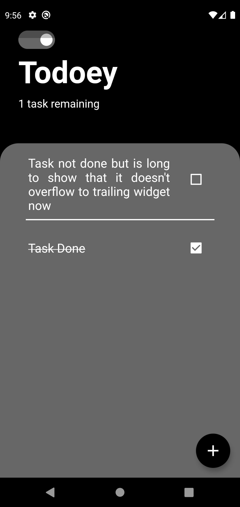

## Todoey Flutter App

With Hive Local Storage and Shared Preference to remember the Theme Mode last used 
Link to Hive documentation : https://pub.dev/packages/hive  
Tutorial I watched for Hive: https://www.youtube.com/watch?v=R1GSrrItqUs  
Link to Shared Preference documentation : https://pub.dev/packages/shared_preferences

## Some Screenshots from the app

 
 

 
 

